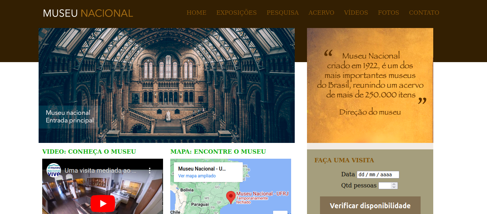
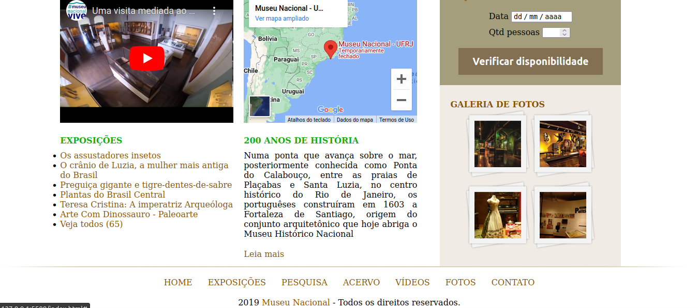
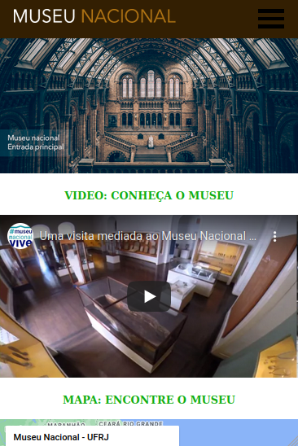
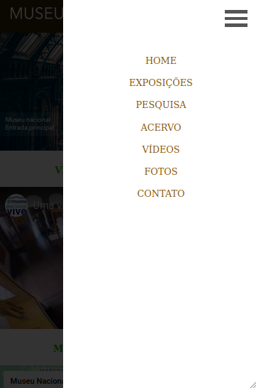

## Objetivo do projeto
Esta réplica tem por objetivo demonstrar algumas das minhas capacidades como desenvolvedor. O site contém apenas uma página.

## Inspiração
A inspiração veio de um curso da Udemy (Desenvolvimento Web completo 2022 - 20 cursos + 20 projetos). Foi implementado algumas mudanças. Dentre elas está uma responsividade simples.

Infelismente, por motivos desconhecidos pro mim, a página não carrega o CSS no Github pages. Por conta disso, deixarei fotos do projeto.

## Desktop

## Mobile

